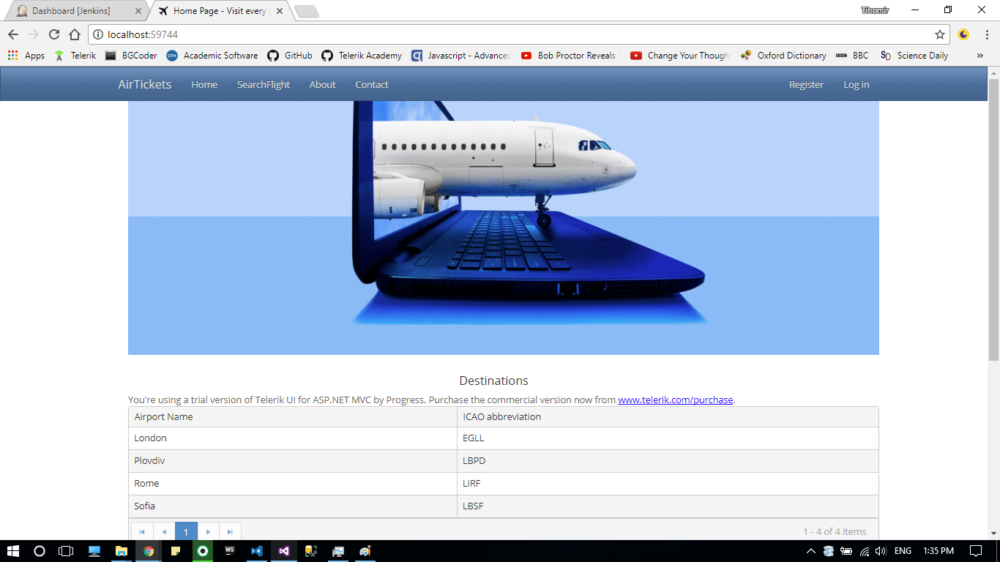
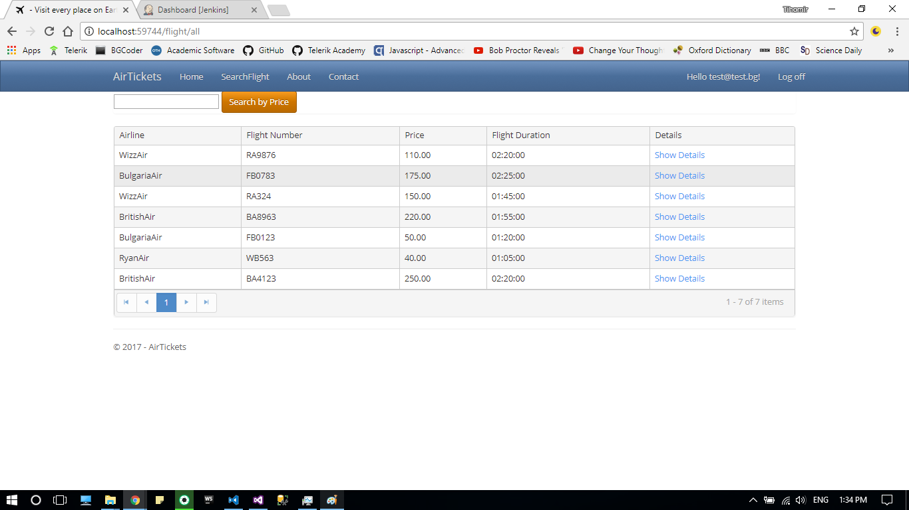

# AirTickets

## Website for buying tickets - MVC 5 final project

### Public part

- Home
    - Table of available airports
    

### User part
    - Table of available flights
    - Show details on every flight
    - Search flight by price
    

### Run Project 
    - Azure : url [a link](https://airtickets-bg.azurewebservices.com)
    - localhost : Ctrl + F5 to start from Visual Studio

### Continuous Integration - Jenkins
    - Unit tests are runned automaticaly on every deploy on GitHub repo

#### Future releases

    - Administrator part
    - More details flight information
    - Book flight and added to user profile
